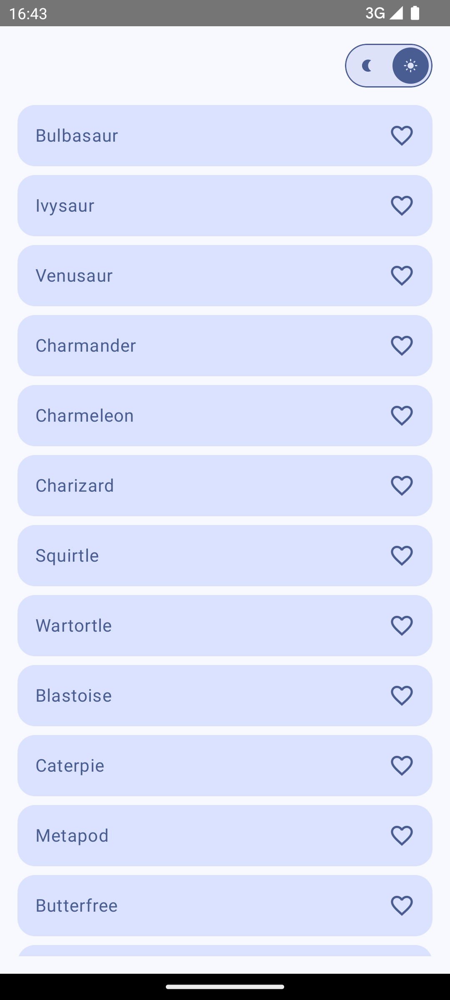

<table>
  <tr>
    <td>
      
    </td>
    <td>
      
    </td>
  </tr>
</table>
The purpose of this app is to provide a robust starting point for future Android projects by adhering to Clean Architecture and SOLID principles. This will save significant time in the initial project setup, ensure maintainability, scalability, and promote a standardized structure for every project.

---

# Architecture

- [UI](#UI)
- [Viewmodels](#viewmodels)
- [Use cases](#use-cases)
- [Repositories](#repositories)
- [Data sources](#data-sources)

## UI
The UI is built with Jetpack Compose and follows a unidirectional data flow. Each screen is composed of a main composable, a UI composable, a state model, and an event model.
#### Main composable
The main composable serves as a navigation destination. It:
- Retrieves the ViewModel instance via dependency injection (Hilt). 
- Observes the state and events to update the UI.
#### UI composable
This composable defines the pure graphical appearance of the screen. It is:
- ViewModel-free to enable easy previews and reusability. 
- Decoupled from the business logic.
#### State model
- Contains dynamic values displayed on the screen (e.g., text fields, remote lists).
- Should be immutable and modeled using Kotlin's data class.
#### Event model
- Captures user interactions (clicks, swipes, etc.).
- Communicates these actions to the ViewModel.
## Viewmodels
- Responsible for maintaining the UI state. 
- Contains only UI-specific logic to update the state.
- Launches business logic operations via use cases.
- Uses StateFlow or LiveData to expose immutable states and events.
## Use cases
- Represent a single business logic action.
- Coordinate interactions between repositories.
- Ensure that application rules and logic are encapsulated and reusable.

```kotlin
class FetchUserProfileUseCase @Inject constructor(
    private val userRepository: UserRepository
) {
    suspend operator fun invoke(userId: String): Result<UserProfile> {
        return userRepository.getUserProfile(userId)
    }
}
```
## Repositories
- Serve as mediators between use cases and data sources.
- Format data from data sources into domain models.
- Handle caching, data merging, or fallback logic if necessary.
## Data sources
- Provide data from local or remote sources.
- Support multiple frameworks (e.g., Room, Retrofit, Datastore).
- Should only focus on data retrieval or persistence.

---

# Modules

* [App](#app)
* [Core](#core)
  * [Common](#common)
  * [Data](#data)
  * [Database](#database)
  * [Datastore](#datastore)
  * [Designsystem](#designsystem)
  * [Domain](#domain)
  * [Network](#network)
* [Feature](#feature)
  * [Home](#home)

## App
- Contains the application class, navigation graphs, and the main activity.
- Entry point for dependency injection.
## Core
- Contains shared modules and infrastructure components.
## Common
- Utilities and helper classes used throughout the app.
- Examples: Result, ErrorHandler, Extensions.
## Data
- Centralized repository and data model definitions.
- Implements domain-level interfaces.
## Database
- Contains local data source implementations.
- Example: Room DAOs and database entities.
## Datastore
- Handles preferences or lightweight key-value storage.
## Designsystem
- Shared UI components and styles.
- Examples: Buttons, typography, color themes.
## Domain
- Defines the core business logic.
- Contains use case implementations and domain models.
## Network
- Contains remote data source implementations.
- Example: Retrofit API services and DTOs.
## Feature
- Encapsulates individual features as independent modules.
- Promotes modularization and reusability.
## Home
- A sample feature module implementing the home page.
- Contains its own ViewModel, UI, and business logic.
---

# Libraries
* [Jetpack compose](https://developer.android.com/compose)
* [Hilt](https://dagger.dev/hilt/)
* [Retrofit](https://square.github.io/retrofit/)
* [Room](https://developer.android.com/training/data-storage/room)

# Principles

## Clean Architecture
- Domain Layer: Independent of other layers. Contains the business logic.
- Data Layer: Implements the domain layer's contracts. Manages data retrieval and persistence.
- Presentation Layer: Displays UI and handles user interactions.

## SOLID Principles
- Single Responsibility: Each class/module should have one reason to change.
- Open/Closed: Modules should be open for extension but closed for modification.
- Liskov Substitution: Derived classes should be substitutable for their base classes.
- Interface Segregation: No client should be forced to depend on methods it doesn't use.
- Dependency Inversion: High-level modules should not depend on low-level modules but on abstractions.

# Enhancements

## Scalability:
- Modularize features to isolate dependencies and reduce build times.
- Leverage feature toggles for experimental functionalities.

## Testability:
- Add unit tests for use cases and view models.
- Use mock repositories for testing.
- Integrate UI tests using Compose Test Framework.

## Performance Optimization:
- Use lazy loading for composables and data.
- Minimize recompositions by leveraging remember and derivedStateOf.

## Code Quality:
- Enforce code style using ktlint.
- Add static analysis tools like Detekt for detecting code smells.
- Integrate continuous integration (CI) for linting, testing, and building.

## Documentation:
- Add detailed KDoc comments for public APIs.
- Maintain a comprehensive README for contributors.

